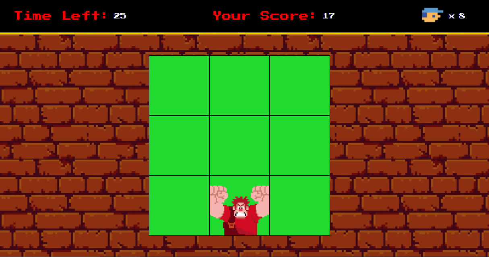

# JS Game Detona Ralph

## Tecnologias Utilizadas:

- HTML5
- CSS3
- JavaScript

## Como Jogar: 

- Abra o jogo no seu navegador clicando [aqui](https://nataliabrunelli.github.io/jogo-detona-ralph/)
- Clique nas casa onde o Ralph aparece
- Acompanhe suas vidas e o tempo restante, além da sua pontuação no campo superior
- Atualize a página para jogar novamente

---

